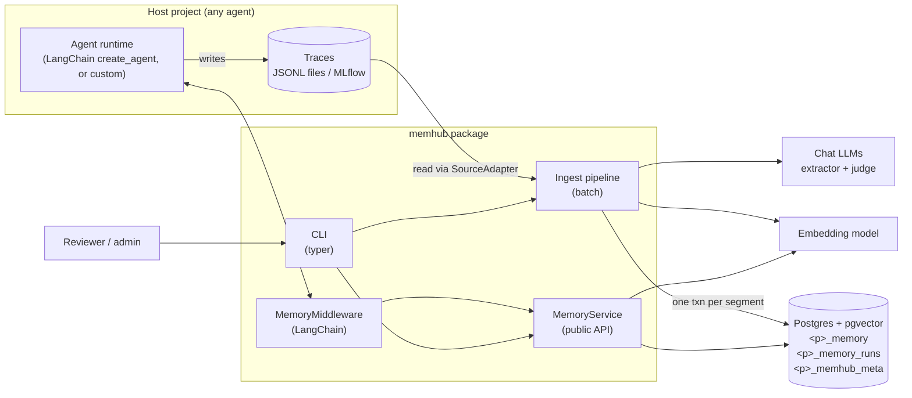
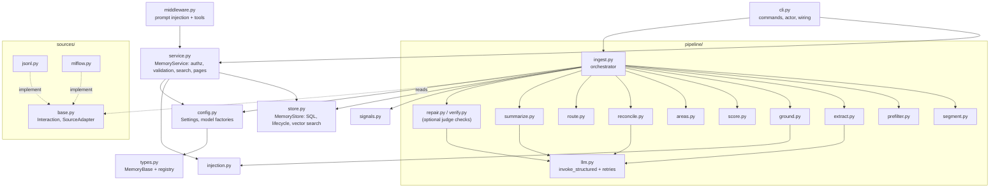
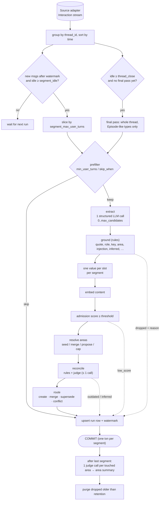
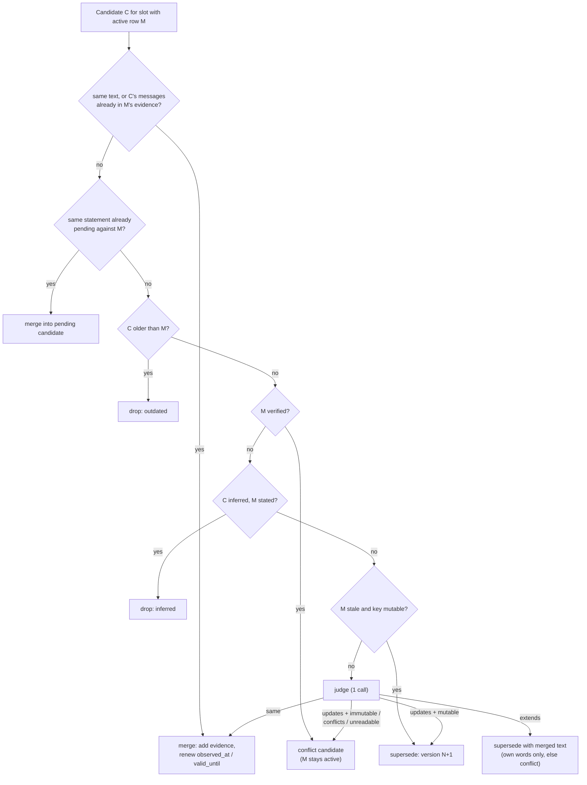
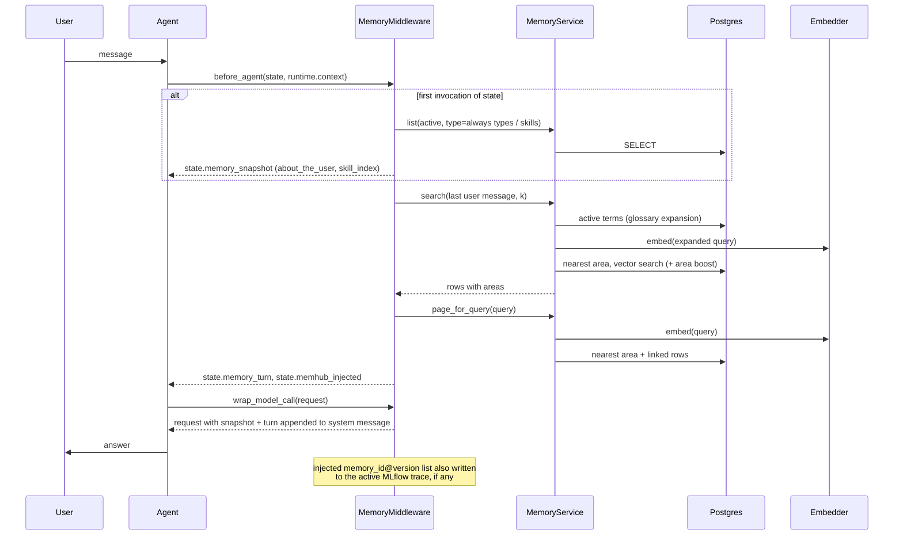
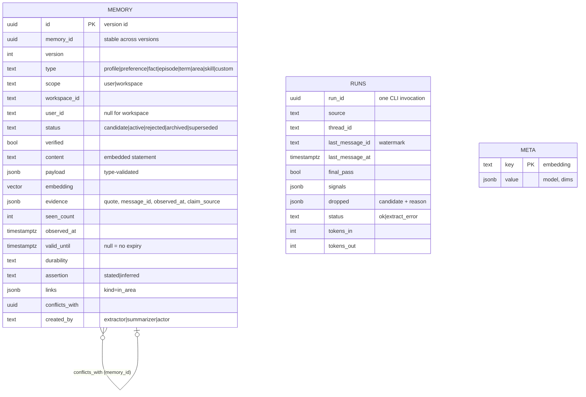
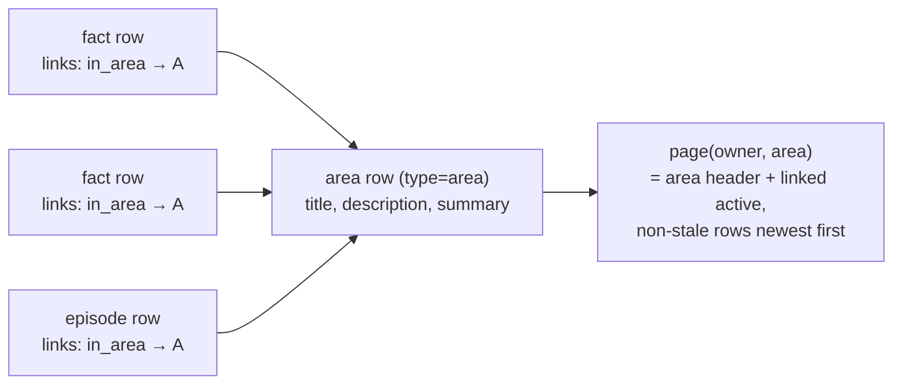
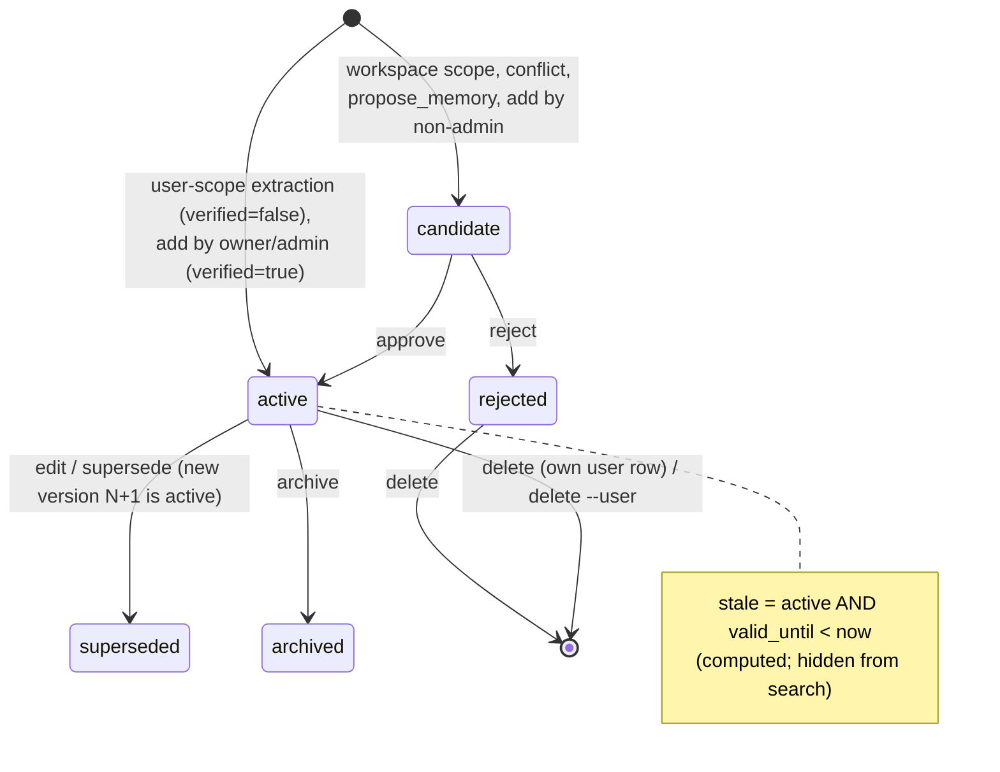
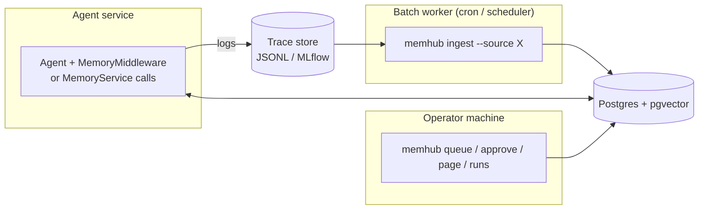

# memhub — Architecture

Diagrams are Mermaid (render on GitHub, VS Code, most doc sites). Rules and field-level detail live in [tdd.md](tdd.md); adoption steps in [integration.md](integration.md).

## At a glance

For a non-technical audience (management, slides, posts). Agents forget between conversations, and memory tools that write on their own can store things that are not true. memhub keeps a small, trustworthy memory: every item is backed by a real quote, dated, versioned, and approved by a person when it is shared.

Source: `img/memhub-overview.html` (arrows are computed from box positions, and the render checks for overflow and overlap). Regenerate: `python img/render.py`.

**Four guarantees**

| | Guarantee | How |
|---|---|---|
| 🔎 | **Evidence first** | Each memory carries the user's own words; a mechanical check rejects anything without one |
| 🕒 | **Time-aware** | Memories are dated by when they were said, can expire, and newer facts replace older ones with history kept |
| 👤 | **Human in the loop** | Shared knowledge and contradictions wait for approval; a person's edit is never overwritten by the AI |
| 🎯 | **Small on purpose** | Caps, one value per attribute and strict filters keep memory short and useful, not a dump of everything said |

Works with any agent framework, any LLM provider, and a single Postgres database.

## 1. Context

memhub sits between an agent's conversation logs and the agent's prompt. It is a library plus CLI, not a service: there is no daemon and no HTTP API. Postgres is the only stateful component.

Dependency direction is one-way: the host depends on memhub; memhub imports nothing from the host. Everything project-specific enters through `memhub.yaml`, a source adapter, or a registered type class.

## 2. Modules

Layering rules:

- `store.py` is the only module that writes SQL. Every method takes an open cursor, so callers group writes into one transaction.
- The ingest pipeline talks to `MemoryStore` directly (it needs several writes per segment in one transaction). Everything else goes through `MemoryService`, which adds authorization, validation, injection scan and embedding.
- `config.py` builds LangChain chat and embedding objects; no provider SDK is imported anywhere else.

## 3. Write path

Every dropped candidate ends in `
_memory_runs.dropped` with a reason; `memhub runs` aggregates them. This is the main tuning tool (thresholds, prompts, caps).

## 4. Reconcile decision (keyed slot)

The most intricate step. For a slot (e.g. `profile/city`) the active row M is found by key, with no similarity search.

Non-keyed candidates use the same rules after a similarity lookup (`duplicate ≥ 0.92` merges; otherwise the nearest rows above `compare_floor` go to one judge call that picks the row it concerns; `unrelated` creates).

## 5. Read path

Search filters: `status='active'`, visible scope (workspace rows of the workspace + the user's own), not stale, not `area` rows. Area match and `related` terms only re-rank; they never filter.

## 6. Data model

Key invariants, enforced by unique indexes and checked in tests after every scenario step:

1. At most one `active` version per `memory_id`.
2. At most one `active` row per `(owner, keyed type, key)`.
3. Versions are contiguous from 1.
4. Every extractor-created row has at least one quote.
5. Evidence contains no duplicate `message_id`.

Area pages are views over this table, not stored documents:

## 7. Memory lifecycle

## 8. Deployment topologies

memhub has no runtime of its own; choose where its two halves run.

- **Ingest** runs periodically (it is idempotent and watermark-driven); one process at a time per thread set.
- **Agent side** needs only read access plus the `propose` write path; the middleware acts as a role-less `Actor("agent")`.
- **Ops** uses the CLI with `MEMHUB_CLI_ROLES` for review.
- All three share `memhub.yaml` (or an equivalent `Settings` object) and the same embedding model; a mismatch with what `init` saved is refused at startup.

## 9. Extension points

| Point | Mechanism | Contract |
|---|---|---|
| New trace source | Class with `read()` (+ optional `signals()`, `skipped`) | Yield `Interaction`; call `ingest_source()` |
| New memory type | Subclass `MemoryBase`, register `module:Class` under `types:` | `content` is the embedded statement; bump `schema_version` on shape change |
| Different LLM / embedder | `llm.*` / `embeddings` config | Chat model must support structured output; embedder needs `embed_query` |
| Project policy | `extraction.instructions`, `types.*.keys`, `areas.seeds`, `skip_when` | Config only |
| Slots | `keyed: true` + `keys` | One active row per `(owner, key)`; reconcile handles it with no code |
| Areas | `area: required|optional` on a type | Requires a seed list or `areas.open: true` |

## 10. Design decisions

| Decision | Alternative | Why |
|---|---|---|
| Postgres + pgvector, two data tables + meta | Vector DB + graph DB | One dependency; transactions across memory and watermark; SQL filters on time, scope, status |
| Version rows, not in-place update | Mutable rows + event log | History and `observed_at` semantics for free; only the newest active row is queried |
| Stale computed, not stored | Expiry job | No background process; time-travel tests just pass `now` |
| Relations as a `links` column | Edge table | Only one hop (`in_area`) is needed; GIN answers "what is in this area" |
| Areas as rows, pages as views | Stored documents | Nothing to keep in sync; summary is the only derived text and is labelled |
| Mechanical grounding | LLM judge for support | Cheap, deterministic, zero-hallucination target; judge checks are opt-in extras |
| Judge called ≤ 1× per candidate, unreadable ⇒ conflict | Retry / auto-pick | Bounded cost; a person decides ambiguity; nothing is overwritten silently |
| Batch ingestion | Write-through on each turn | Segments need idle time for context; traces are already durable |
| CLI as the only review UI | Web hub | Scope of v1; the `MemoryService` API is the seam for a future UI |
